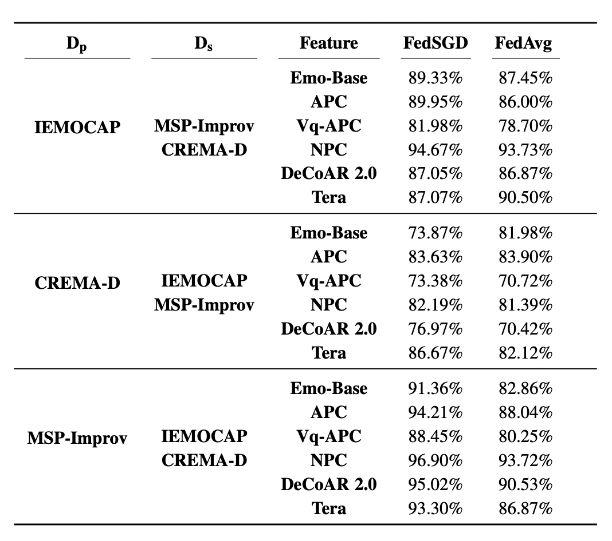

# Attribute Information Leakage of SER Application in Federated Learning
This repository contains the official implementation (in [PyTorch](https://pytorch.org/)) of Attribute Inference Attack of Speech Emotion Recognition in Federated Learning.


## Speech Features

We extract a variety of speech representations using OpenSMILE toolkit and pretrained models. You can refer to [OpenSMILE](https://www.audeering.com/research/opensmile/) and [SUPERB](https://arxiv.org/abs/2105.01051) paper for more information.

Below is a listed of features that we include in the current experiment:

Publication Date | Model | Name | Paper | Input | Stride | Pre-train Data | Official Repo 
|---|---|---|---|---|---|---|---
--- | EmoBase | --- | [MM'10](https://dl.acm.org/doi/10.1145/1873951.1874246) | Speech | --- | --- | [EmoBase](https://www.audeering.com/research/opensmile/)
5 Apr 2019 | APC | apc | [arxiv](https://arxiv.org/abs/1904.03240) | Mel | 10ms | [LibriSpeech-360](http://www.openslr.org/12) | [APC](https://github.com/Alexander-H-Liu/NPC)
17 May 2020 | VQ-APC | vq_apc | [arxiv](https://arxiv.org/abs/2005.08392) | Mel | 10ms | [LibriSpeech-360](http://www.openslr.org/12) | [NPC](https://github.com/Alexander-H-Liu/NPC)
12 Jul 2020 | TERA | tera | [arxiv](https://arxiv.org/abs/2007.06028) | Mel | 10ms | [LibriSpeech-960](http://www.openslr.org/12) | [S3PRL](https://github.com/andi611/Self-Supervised-Speech-Pretraining-and-Representation-Learning)
1 Nov 2020 | NPC | npc | [arxiv](https://arxiv.org/abs/2011.00406) | Mel | 10ms | [LibriSpeech-360](http://www.openslr.org/12) | [NPC](https://github.com/Alexander-H-Liu/NPC)
Dec 11 2020 | DeCoAR 2.0 | decoar2 | [arxiv](https://arxiv.org/abs/2012.06659) | Mel | 10ms | [LibriSpeech-960](http://www.openslr.org/12) | [speech-representations](https://github.com/awslabs/speech-representations)

## Federated Learning - SER results

Let's recap the basic of the FL. 

1. In a typical FL training round shown in the figure below, a subset of selected clients receive a global model, which they can locally train with their private data. 

2. Afterward, the clients only share their model updates (model parameters/gradients) to the central server. 

3. Finally, the server aggregates the model updates to obtain the global model for the next training round. 


Two common scenarios in FL are:

#### 1. FedSGD (gradients are shared): 

<p align="center"></p>

#### 2. FedAvg (model parameters are shared): 

<p align="center"></p>


Table shows the prediction results of the SER model trained in two FL scenarios: FedSGD and FedAvg. We report the accuracy and unweighted average recall (UAR) scores of the SER task on each individual data set. In the baseline experiment, we set the learning rate as 0.05 and 0.0005 in FedSGD and FedAvg, respectively. The local batch size is 20, and global training epoch is set to 200. 10% of the clients participant in each global training epoch.


## Attack Problem Setup

The figure shows the problem setup of the attribute inference attack in this work. **The primary application is SER**, where the **adversaries (the outside attacker or the curious server) attempt to predict the gender (the sensitive attribute)** using the shared model updates training the SER model.


<p align="center"></p>


## Attack Framework

Our attack framework mimics the attack framework commonly used in the membership inference attack (MIA). The attack framework consists of training shadow models, forming attack trianing data set, and training the attack model as shown below.

<p align="center"></p>

#### 1. Shadow Training

The idea of the shadow training is to mimic the private training. Here, we train each shadow model with the same hyperparameters used in the private FL training. We train 5 shadow models in our experiment.


#### 2. Constructing Attack Training Data Set

Here, we construct our attack training data set using the gradients input data and the client's gender label. We pick 80% of the data as training, and rest as validation. The test set are the shared model updates generated in the private training, and the attack model aims to predict the gender label of the client in the private training data set.

#### 3. Attack Model

Our attack model architecture is shown below: 

<p align="center"></p>

## So how easy is the attack?

The short answer is: inferring gender (UAR score in the table) of the client using the shared model updates is a trivial task when training the SER model in both FedSGD and FedAvg.

<p align="center"></p>


## So which layer leaks most information in this attack?

The short answer is: the shared updates between feature input and first dense layer (UAR score in the table).

<p align="center"></p>


## So will the dropout decrease the attack performance?

The short answer is: the increased dropout makes the attack stronger in this attack (UAR score in the table).

<p align="center"></p>


If you want to cite this work, please use:

```
@misc{feng2021attribute,
      title={Attribute Inference Attack of Speech Emotion Recognition in Federated Learning Settings}, 
      author={Tiantian Feng and Hanieh Hashemi and Rajat Hebbar and Murali Annavaram and Shrikanth S. Narayanan},
      year={2021},
      eprint={2112.13416},
      archivePrefix={arXiv}
}
```

## Other Referecences


**[OpenSMILE](https://www.audeering.com/research/opensmile/)**
```
@inproceedings{eyben2010opensmile,
  title={Opensmile: the munich versatile and fast open-source audio feature extractor},
  author={Eyben, Florian and W{\"o}llmer, Martin and Schuller, Bj{\"o}rn},
  booktitle={Proceedings of the 18th ACM international conference on Multimedia},
  pages={1459--1462},
  year={2010}
}
```

**[SUPERB](https://arxiv.org/abs/2105.01051)**

```
@inproceedings{yang21c_interspeech,
  author={Shu-wen Yang and Po-Han Chi and Yung-Sung Chuang and Cheng-I Jeff Lai and Kushal Lakhotia and Yist Y. Lin and Andy T. Liu and Jiatong Shi and Xuankai Chang and Guan-Ting Lin and Tzu-Hsien Huang and Wei-Cheng Tseng and Ko-tik Lee and Da-Rong Liu and Zili Huang and Shuyan Dong and Shang-Wen Li and Shinji Watanabe and Abdelrahman Mohamed and Hung-yi Lee},
  title={{SUPERB: Speech Processing Universal PERformance Benchmark}},
  year=2021,
  booktitle={Proc. Interspeech 2021},
  pages={1194--1198},
  doi={10.21437/Interspeech.2021-1775}
}
```